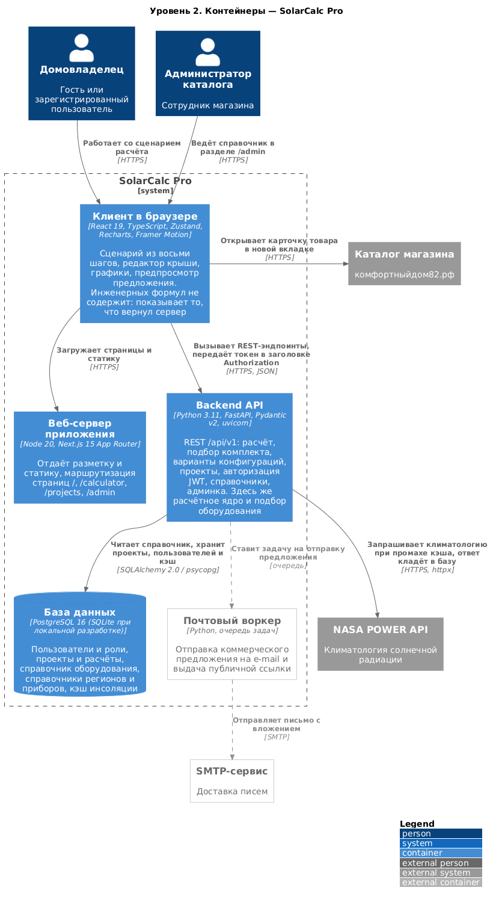
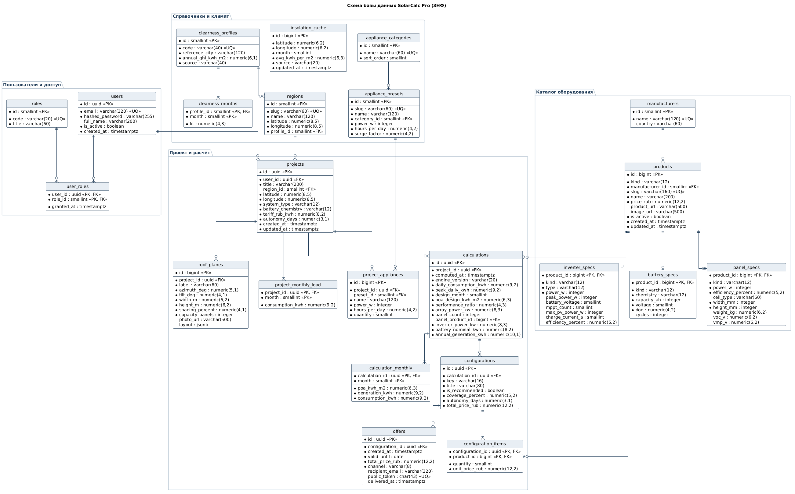

# Архитектура информационной системы SolarCalc Pro

## Общая информация

SolarCalc Pro — веб-платформа для расчёта и проектирования солнечных электростанций частных домов.

Система предназначена для расчёта потребления электроэнергии дома, определения прихода солнечной радиации по координатам, подбора мощности массива панелей, ёмкости накопителя и инвертора, размещения панелей на снимке крыши, формирования вариантов комплектации из реального каталога оборудования и подготовки коммерческого предложения.

Основными пользователями системы являются домовладельцы (гости и зарегистрированные пользователи) и администратор каталога оборудования.

---

# Архитектурный стиль

Система реализована на основе клиент-серверной архитектуры.

Серверная часть построена как модульный монолит: эндпоинты, схемы валидации, расчётное ядро, подбор оборудования и доступ к данным разделены на слои внутри одного приложения. Все инженерные формулы выполняются на сервере — клиент отображает результат и не содержит расчётной логики, поэтому значения на экране и в коммерческом предложении не могут разойтись.

Взаимодействие между клиентом и сервером осуществляется посредством REST API (`/api/v1`), авторизация — по JWT.

---

# Контейнеры системы

## Web Client

Технологии:

- Next.js 15 (App Router)
- React 19
- TypeScript
- Tailwind CSS 4
- Zustand
- Recharts

Назначение:

- пошаговый сценарий расчёта (потребление → дом → солнце → крыша → система → результат → оборудование → проект);
- редактор размещения панелей на снимке крыши;
- графики потребления, выработки и энергобаланса;
- сравнение вариантов комплектации;
- предпросмотр и печать коммерческого предложения;
- личный кабинет с сохранёнными проектами;
- раздел администратора для ведения каталога.

---

## Backend API

Технологии:

- Python 3.11
- FastAPI
- Pydantic v2
- SQLAlchemy 2.0
- httpx

Назначение:

- обработка запросов клиентов и валидация входных данных;
- расчёт солнечной геометрии и инсоляции;
- расчёт мощности массива, ёмкости накопителя, мощности инвертора, помесячной выработки и экономики;
- подбор оборудования из каталога и проверка совместимости;
- формирование вариантов комплектации;
- регистрация, авторизация и разграничение прав;
- управление проектами пользователей;
- управление справочником оборудования;
- получение климатологии из NASA POWER и её кэширование.

---

## Database

Технологии:

- PostgreSQL (в разработке — SQLite)

Назначение:

- хранение пользователей и ролей;
- хранение проектов, профилей потребления и скатов крыши;
- хранение расчётов, вариантов комплектации и предложений;
- хранение каталога оборудования;
- хранение справочников регионов, климатических профилей и типовых приборов;
- кэш инсоляции.

---

## Внешние системы

- NASA POWER API — климатология солнечной радиации по координатам точки;
- каталог магазина «Комфортный дом» (комфортныйдом82.рф) — карточки реального оборудования, на которые ведут ссылки из системы;
- почтовый сервис — отправка коммерческого предложения; точка интеграции спроектирована, но не подключена.

---

# Диаграмма контейнеров C4

Система включает следующие контейнеры:

- Клиент в браузере (React 19);
- Веб-сервер приложения (Next.js 15);
- Backend API (FastAPI);
- База данных (PostgreSQL);
- Почтовый воркер (планируется).

Пользователь работает со сценарием расчёта через веб-интерфейс. Клиент получает страницы и статику от веб-сервера приложения и вызывает REST-эндпоинты Backend API, передавая JWT в заголовке `Authorization`. Backend API выполняет расчёты, читает каталог и хранит проекты в базе данных; при отсутствии данных в кэше запрашивает климатологию у NASA POWER и сохраняет ответ. Ссылки на оборудование ведут во внешний каталог магазина.

---

# Пользовательские роли

## Гость

Домовладелец без учётной записи.

Основные возможности:

- ввод потребления: перечнем приборов, суточным значением или помесячно по квитанциям;
- выбор населённого пункта или точки на карте;
- получение оптимального угла наклона и потерь от ориентации;
- размещение панелей на снимке крыши;
- расчёт станции: массив, накопитель, инвертор, выработка, экономика;
- сравнение вариантов комплектации и замена компонентов;
- формирование коммерческого предложения и сохранение в PDF.

---

## Пользователь

Зарегистрированный домовладелец.

Основные возможности:

- все возможности гостя;
- регистрация и авторизация;
- сохранение расчёта как проекта;
- просмотр списка своих проектов;
- переименование, обновление, дублирование и удаление проектов.

---

## Администратор каталога

Сотрудник магазина оборудования.

Основные возможности:

- все возможности пользователя;
- добавление, изменение и снятие с публикации панелей, инверторов и аккумуляторов;
- ведение цен, ссылок на товары и изображений;
- просмотр сводки по справочнику, проектам и пользователям.

---

# Сценарии использования

| Роль | Сценарий | Эндпоинты |
|---|---|---|
| Гость | Задать потребление | `GET /reference/appliances` |
| Гость | Указать дом и локацию | `GET /reference/regions`, `GET /reference/insolation` |
| Гость | Получить оптимальный угол и потери | `POST /calculate/tilt` |
| Гость | Рассчитать станцию | `POST /calculate` |
| Гость | Получить и сравнить варианты комплектации | `POST /equipment/configurations`, `GET /equipment/panels`, `GET /equipment/inverters`, `GET /equipment/batteries` |
| Гость | Заменить компонент с пересчётом | `POST /equipment/select`, `POST /calculate` |
| Пользователь | Зарегистрироваться, войти | `POST /auth/register`, `POST /auth/login`, `GET /auth/me` |
| Пользователь | Сохранить проект | `POST /projects` |
| Пользователь | Открыть список и проект | `GET /projects`, `GET /projects/{id}` |
| Пользователь | Обновить, дублировать, удалить проект | `PATCH /projects/{id}`, `POST /projects/{id}/duplicate`, `DELETE /projects/{id}` |
| Администратор | Вести каталог оборудования | `POST/PATCH/DELETE /admin/panels`, `/admin/inverters`, `/admin/batteries` |
| Администратор | Посмотреть сводку | `GET /admin/stats` |

---

# Основные сущности базы данных

В системе используются следующие основные сущности:

- User — пользователь;
- Project — проект (дом и условия расчёта);
- Calculation — расчёт станции;
- Configuration — вариант комплектации;
- Product — товар каталога (панель, инвертор, аккумулятор);
- Offer — коммерческое предложение.

Дополнительно используются вспомогательные сущности:

- Role, UserRole;
- ProjectMonthlyLoad, ProjectAppliance, RoofPlane;
- CalculationMonthly, ConfigurationItem;
- Manufacturer, PanelSpecs, InverterSpecs, BatterySpecs;
- Region, ClearnessProfile, ClearnessMonth, InsolationCache;
- ApplianceCategory, AppliancePreset.

---

# Структура базы данных

## Пользователи и доступ

- **users** — id (PK, uuid), email (UNIQUE), hashed_password, full_name, is_active, created_at;
- **roles** — id (PK), code (UNIQUE: owner, admin), title;
- **user_roles** — user_id (PK, FK users), role_id (PK, FK roles), granted_at. Связь «многие ко многим» между пользователями и ролями.

## Проект и расчёт

- **projects** — id (PK, uuid), user_id (FK users), title, region_id (FK regions), latitude, longitude, system_type (on_grid / hybrid / off_grid), battery_chemistry (AGM / GEL / LiFePO4), tariff_rub_kwh, autonomy_days, created_at, updated_at;
- **project_monthly_load** — project_id (PK, FK projects), month (PK, 1–12), consumption_kwh. Ровно 12 строк на проект;
- **project_appliances** — id (PK), project_id (FK projects), preset_id (FK appliance_presets, необязательное), name, power_w, hours_per_day, quantity. Связь «многие ко многим» между проектами и справочником приборов с собственными атрибутами;
- **roof_planes** — id (PK), project_id (FK projects), label, azimuth_deg, tilt_deg, width_m, height_m, shading_percent, capacity_panels, photo_url, layout (jsonb — координаты ската и сетка модулей на снимке);
- **calculations** — id (PK, uuid), project_id (FK projects), computed_at, engine_version, daily_consumption_kwh, peak_daily_kwh, design_month, poa_design_kwh_m2, performance_ratio, array_power_kw, panel_count, panel_product_id (FK products), inverter_power_kw, battery_nominal_kwh, annual_generation_kwh. Каждый пересчёт — новая строка, история сохраняется;
- **calculation_monthly** — calculation_id (PK, FK calculations), month (PK), poa_kwh_m2, generation_kwh, consumption_kwh;
- **configurations** — id (PK, uuid), calculation_id (FK calculations), key (recommended / no_battery / roof_max / winter / autonomy), title, is_recommended, coverage_percent, autonomy_days, total_price_rub. UNIQUE (calculation_id, key);
- **configuration_items** — configuration_id (PK, FK configurations), product_id (PK, FK products), quantity, unit_price_rub (цена на момент подбора). Связь «многие ко многим» между вариантами комплектации и товарами;
- **offers** — id (PK, uuid), configuration_id (FK configurations), created_at, valid_until, total_price_rub, channel (pdf / email / link / saved), recipient_email, public_token (UNIQUE), delivered_at.

## Каталог оборудования

- **manufacturers** — id (PK), name (UNIQUE), country;
- **products** — id (PK), kind (panel / inverter / battery), manufacturer_id (FK manufacturers), slug (UNIQUE), name, price_rub, product_url, image_url, is_active, created_at, updated_at. Общие поля всех позиций каталога;
- **panel_specs** — product_id (PK, FK products), kind, power_w, efficiency_percent, cell_type, width_mm, height_mm, weight_kg, voc_v, vmp_v;
- **inverter_specs** — product_id (PK, FK products), kind, type (on_grid / hybrid / off_grid), power_w, peak_power_w, battery_voltage (12 / 24 / 48), mppt_count, max_pv_power_w, charge_current_a, efficiency_percent;
- **battery_specs** — product_id (PK, FK products), kind, chemistry (AGM / GEL / LiFePO4), capacity_ah, voltage, dod, cycles.

Таблицы характеристик связаны с products отношением «один к одному». Составной внешний ключ (product_id, kind) → products (id, kind) не позволяет привязать характеристики панели к инвертору.

## Справочники и климат

- **clearness_profiles** — id (PK), code (UNIQUE), reference_city, annual_ghi_kwh_m2, source;
- **clearness_months** — profile_id (PK, FK clearness_profiles), month (PK), kt — индекс ясности атмосферы по месяцам;
- **regions** — id (PK), slug (UNIQUE), name, latitude, longitude, profile_id (FK clearness_profiles);
- **insolation_cache** — id (PK), latitude, longitude, month, avg_kwh_per_m2, source (nasa / model), updated_at. UNIQUE (latitude, longitude, month). Внешних ключей нет: строка описывает точку сетки 0,25°, а не регион;
- **appliance_categories** — id (PK), name (UNIQUE), sort_order;
- **appliance_presets** — id (PK), slug (UNIQUE), name, category_id (FK appliance_categories), power_w, hours_per_day, surge_factor.

## Связи между таблицами

- пользователь имеет несколько ролей, роль назначена многим пользователям (N:M через user_roles);
- пользователь владеет проектами (1:N);
- регион уточняет климат проекта (1:N);
- проект содержит помесячное потребление, перечень приборов и скаты крыши (1:N);
- проект порождает расчёты — историю версий (1:N);
- расчёт содержит помесячные ряды и варианты комплектации (1:N);
- вариант комплектации состоит из товаров (N:M через configuration_items);
- по варианту комплектации формируются предложения (1:N);
- производитель выпускает товары (1:N);
- товар имеет характеристики своего типа (1:1);
- климатический профиль содержит 12 месячных коэффициентов и относится к регионам (1:N);
- категория объединяет типовые приборы (1:N).

## Ключи, ограничения и индексы

- первичные ключи: uuid для пользовательских данных (users, projects, calculations, configurations, offers), целочисленные для справочников и каталога, составные для таблиц-связей;
- внешние ключи: состав удаляется вместе с владельцем (ON DELETE CASCADE), справочник, на который ссылаются, удалить нельзя (ON DELETE RESTRICT) — позиции каталога снимаются с публикации флагом is_active;
- ограничения CHECK: диапазоны широты и долготы, месяц 1–12, положительные мощность и тариф, перечисления типов системы, химии аккумулятора, вида товара и канала доставки, dod в интервале (0; 1];
- ограничения UNIQUE: email, slug, (calculation_id, key), (latitude, longitude, month), public_token; частичный уникальный индекс гарантирует один рекомендованный вариант на расчёт;
- индексы по внешним ключам и частым запросам: (user_id, updated_at) для списка проектов, (project_id, computed_at) для последнего расчёта, (kind, is_active) для выборки активных товаров, name для поиска региона.

Все таблицы спроектированы в соответствии с требованиями третьей нормальной формы (3NF): атрибуты атомарны (помесячные значения и перечни хранятся строками, а не массивами), неключевые атрибуты зависят от всего ключа, транзитивные зависимости устранены выносом производителей, категорий и климатических профилей в отдельные таблицы, производные величины не хранятся.

---

# Логика работы системы

Работа начинается с ввода потребления: пользователь перечисляет приборы из справочника, задаёт суточный расход или вносит 12 помесячных значений из квитанций.

Далее указывается дом: населённый пункт или точка на карте. Система получает помесячную инсоляцию для точки — из кэша, из NASA POWER или по собственной модели — и определяет оптимальный угол наклона и потери от ориентации ската.

Пользователь размещает панели на снимке крыши; число размещённых модулей передаётся в расчёт. Расчётное ядро определяет расчётный месяц, мощность массива, ёмкость накопителя, мощность инвертора, помесячную выработку, энергобаланс и экономику.

По результату расчёта формируются варианты комплектации из каталога: рекомендуемый, без накопителя, на всю крышу, с зимним запасом, автономный. Пользователь сравнивает варианты, при необходимости заменяет компоненты — система пересчитывает результат и проверяет совместимость.

Итог — коммерческое предложение с составом оборудования и стоимостью. Зарегистрированный пользователь сохраняет проект и возвращается к нему позже; администратор ведёт каталог оборудования, из которого собираются комплекты.
